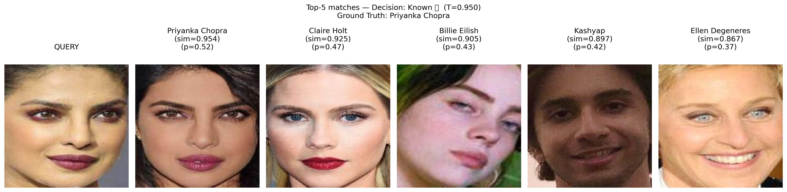
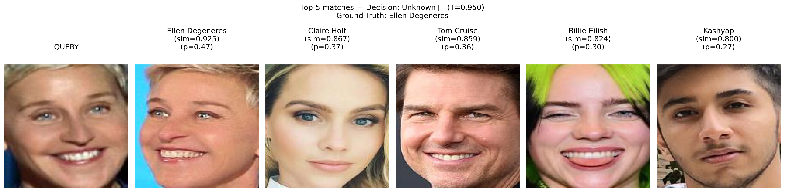
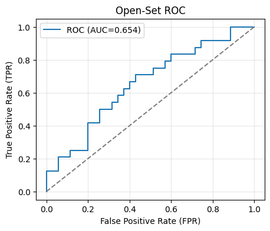
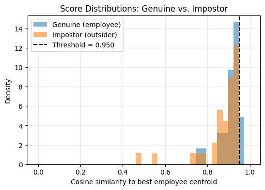
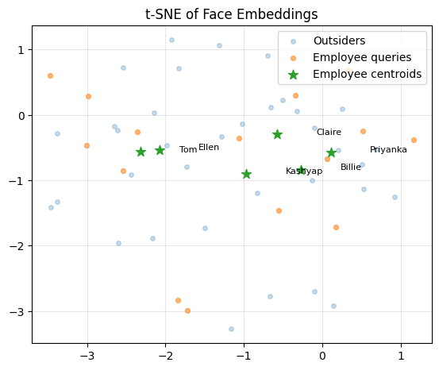

# Learning Visual Similarity with Siamese Networks: Similarity Search, Metric Learning, and Face Verification

This repository contains the PyTorch implementation and report assets for three connected Siamese-network–based systems:

1. **Image similarity search engine** on the **Totally Looks Like (TLL)** dataset  
2. **Metric-learning comparison** between **contrastive loss** and **triplet loss**  
3. **Open-set face verification system** for a small company that:
   - decides whether a face belongs to any registered employee  
   - identifies the most likely employee if it is registered  
   - returns a **Top-5 ranked list** of employee faces with **matching probabilities**  

All experiments are built around **Siamese Networks** and **shared embedding spaces**, focusing on *learning visual similarity* instead of just closed-set classification.

---

## 🔗 Code Availability (Colab Notebooks)

Each part of the assignment is implemented in a dedicated Google Colab notebook:

- **Task 1 — Siamese Similarity Search Engine (Totally Looks Like)**  
  👉 [Open Task 1 Notebook](https://colab.research.google.com/drive/1pAgBK8tXHldP9B-0xeoVpXJdWuCSel5U?usp=sharing)

- **Task 2 — Contrastive vs Triplet Loss for Metric Learning**  
  👉 [Open Task 2 Notebook](https://colab.research.google.com/drive/16vo5tW_lVJ2V7waVfNvM70lxPQ5zRuqa?usp=sharing)

- **Task 3 — Open-Set Face Verification System with Top-5 Ranking**  
  👉 [Open Task 3 Notebook](https://colab.research.google.com/drive/16mfb_u2DkJzwSxSWuivvoslNnzRW1Iq7?usp=sharing)

Each notebook is self-contained: it covers dataset loading, training, evaluation, and visualization.

---

## 🧠 Assignment Overview

This repository implements the following tasks:

1. **Siamese Network–based Image Similarity Search Engine**  
   using the **Totally Looks Like** dataset to learn a visual similarity space.

2. **Metric-Learning Loss Comparison**  
   comparing the performance of the search engine when trained with:
   - **Contrastive loss**
   - **Triplet loss**

3. **Face Verifier for a Small Company (Open-Set)**  
   A Siamese-based verifier that:
   - first decides whether a query face belongs to any registered employee  
   - then checks whether it matches a **specific employee**  
   - finally produces a **Top-5 ranked list** of employees’ faces with **matching probabilities**

---

## 📦 Datasets

### 1️⃣ Totally Looks Like (TLL) Dataset

- Approx. **6,016** matched left–right pairs  
- Pairs are defined via shared filename stem  
- Encourages **visual similarity** learning rather than strict identity matching  
- Used in:
  - **Task 1:** similarity search engine  
  - **Task 2:** metric learning loss comparison  

Example matched pairs:

<p align="center">
  
</p>

*Figure: Matched pairs from the Totally Looks Like dataset. Each row shows a left–right pair that “totally looks like” each other.*

---

### 2️⃣ Face Dataset for Employee Verification

- ~**2,562** images  
- **31 identities** (celebrities used as proxies for “employees”)  
- After filtering for enough samples per identity, a subset is used:
  - A few identities chosen as **registered employees**
  - Remaining identities treated as **outsiders / unknowns**
- Faces are detected, cropped, and aligned with classical detectors (e.g., Haar Cascade).  
- Used entirely in **Task 3** for face verification and Top-5 identity ranking.

---

## 🧱 Model and Training Overview

Across all tasks, the core building block is a **Siamese Network** with:

- **Backbone:** a CNN (e.g., ResNet-18)  
- **Embedding head:** projects images into a low-dimensional L2-normalized vector  
- **Distance metric:** cosine similarity in the embedding space  

We explore two metric-learning losses:

- **Contrastive loss:** operates on pairs (positive / negative)  
- **Triplet loss:** operates on triplets (anchor, positive, negative), often with hard negative mining

For face verification, we extend this into a **prototype-based classifier** with:

- Identity **centroids** formed by averaging multiple embeddings per employee  
- **Cosine similarity** between query embedding and each centroid  
- **Open-set threshold** for deciding employee vs “unknown”  
- **Top-5 ranking** + **probability calibration** using a logistic model (Platt scaling)

---

## 🔍 Task 1 – Siamese Similarity Search on Totally Looks Like

In Task 1, we build a visual similarity search engine:

1. Organize the TLL dataset into positive pairs.  
2. Train a Siamese Network with **contrastive loss**:
   - Positive pairs ⇒ embeddings are pulled closer  
   - Negative pairs ⇒ embeddings are pushed apart beyond a margin  
3. Encode the test images into embeddings.  
4. Build a **nearest-neighbor index** (cosine similarity).  
5. For a query image, retrieve Top-K most similar images.

### Example: TLL Similarity Result

<p align="center">
  
</p>

*Figure: Sample output of the similarity search engine on TLL. The leftmost image is the query; the next images are the Top-5 most similar retrieved candidates.*

---

## ⚖️ Task 2 – Contrastive vs Triplet Loss (Metric Learning)

In Task 2, we keep everything the same **except** the loss function:

- Same backbone (ResNet-18)
- Same embedding dimension
- Same augmentation and training setup
- Only change: **contrastive loss** vs **triplet loss**

We then:

- Compute embeddings for the test set  
- Evaluate **retrieval quality** using:
  - Recall@1, Recall@5, Recall@10  
  - mAP@10  

### Qualitative Retrieval Example

<p align="center">
  
</p>

*Figure: Top-5 retrieval example from the trained Siamese model on TLL. The leftmost image is the query, followed by ranked candidates.*

### Quantitative Comparison (Example)

| Loss        | Margin | R@1   | R@5   | R@10  | mAP@10 |
|------------|--------|-------|-------|-------|--------|
| Triplet    | 0.2    | 0.093 | 0.189 | 0.252 | 0.135  |
| Contrastive| 0.3    | 0.043 | 0.123 | 0.178 | 0.077  |

**Observation:**  
Triplet loss consistently outperforms contrastive loss on TLL retrieval, producing more discriminative embeddings and better ranked lists.

---

## 🧾 Task 3 – Open-Set Face Verification & Top-5 Identity Ranking

Task 3 turns the metric-learning backbone into a **face verifier** for a small “company.”

The pipeline:

1. **Face preprocessing**
   - Face detection (e.g., Haar Cascades)
   - Crop, align, resize (e.g., 112×112), normalize
2. **Embedding**
   - Use Siamese-trained ResNet backbone to embed each face
3. **Employee gallery**
   - For each registered employee, average multiple embeddings ⇒ **identity centroid**
4. **Verification**
   - For a query face:
     - Embed the face
     - Compute cosine similarity to each centroid
     - Find max similarity and compare with a threshold \(T\)
       - If similarity < T ⇒ **Unknown**
       - If similarity ≥ T ⇒ **Known employee**
5. **Top-5 identity ranking**
   - Rank all employees by similarity
   - Apply probability calibration to convert similarity → probability
   - Return **Top-5 employees** with similarity & probability scores

### Known Employee Example

<p align="center">
  
</p>

*Figure: Top-5 retrieval for a **known** employee (e.g., Priyanka Chopra). The system identifies the correct employee and ranks that identity at the top, with high similarity and probability.*

### Unknown Identity Example

<p align="center">
  
</p>

*Figure: Top-5 retrieval for an **unknown** identity (e.g., Ellen DeGeneres). Although some visually similar faces are retrieved, the max similarity stays below the threshold, so the system correctly labels the query as “Unknown.”*

> You can also find additional Top-5 examples in:
> - `top5_Billie_Eilish_3.png`  
> - `top5_Kashyap_25.png`  

### Open-Set ROC and Score Distributions

<p align="center">
  
</p>

*Figure: ROC curve for open-set face verification. The operating threshold is chosen to satisfy a strict false match rate.*

<p align="center">
  
</p>

*Figure: Cosine similarity distributions for genuine employees vs outsiders. The threshold \(T\) is set above the impostor cluster.*

### Embedding Space Visualization

<p align="center">
  
</p>

*Figure: t-SNE visualization of employee centroids, employee queries, and outsider embeddings. Employee queries cluster near their centroids; outsiders are more scattered.*

---


# 👤 Author

Akif Islam
Department of Computer Science & Engineering
University of Rajshahi, Bangladesh
📧 iamakifislam@gmail.com

Please cite this paper if you use any code snippet or take help from here:

```bibtex
@misc{ameen2025detectingaigeneratedimagesdiffusion,
      title={Detecting AI-Generated Images via Diffusion Snap-Back Reconstruction: A Forensic Approach}, 
      author={Mohd Ruhul Ameen and Akif Islam},
      year={2025},
      eprint={2511.00352},
      archivePrefix={arXiv},
      primaryClass={cs.CV},
      url={https://arxiv.org/abs/2511.00352}, 
}